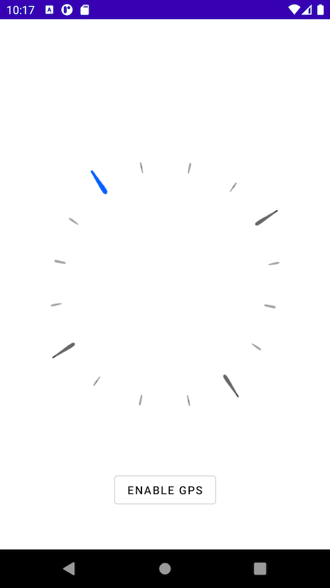
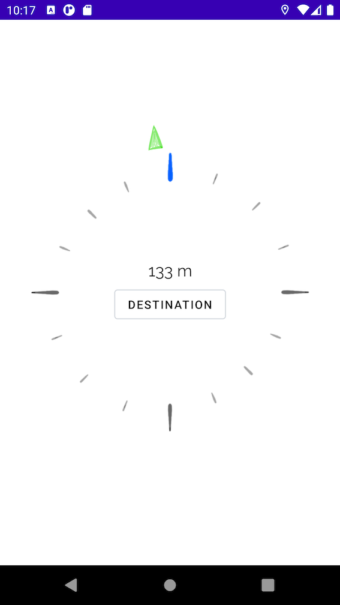

## Compass
  
Application allowing true north detection and with enabled GPS it tracks distance and points to selected direction.  
  
Used libraries:  
  
 - [Mockk](https://github.com/mockk/mockk)
 - [Koin](https://github.com/InsertKoinIO/koin)  
 - [Dexter](https://github.com/Karumi/Dexter)  
 - [Material dialogs](https://github.com/afollestad/material-dialogs)
 

